# StormWatch AI — End-to-End ML Report

> **Project**: Extreme Weather Early Warning System  
> **Version**: 1.0.0  
> **Date**: June 2026  
> **Author**: StormWatch AI Team

---

## Table of Contents

1. [Executive Summary](#1-executive-summary)
2. [Problem Definition](#2-problem-definition)
3. [Data Pipeline](#3-data-pipeline)
    - 3.4 [PySpark ETL Pipeline](#34-pyspark-etl-pipeline)
4. [Feature Engineering](#4-feature-engineering)
5. [Model Architecture](#5-model-architecture)
6. [Training Pipeline & MLflow](#6-training-pipeline--mlflow)
7. [Model Evaluation](#7-model-evaluation)
8. [Serving & API](#8-serving--api)
9. [Monitoring & Observability](#9-monitoring--observability)
10. [Deployment](#10-deployment)
11. [Test Suite](#11-test-suite)
12. [Project Structure](#12-project-structure)
13. [How to Reproduce](#13-how-to-reproduce)
14. [Future Work](#14-future-work)

---

## 1. Executive Summary

StormWatch AI is an end-to-end machine learning system for extreme weather prediction in the Indian subcontinent. It provides **three production-grade models**:

| Model | Task | Type | Accuracy | ROC-AUC |
|-------|------|------|----------|---------|
| **Cyclone Intensity** | Saffir-Simpson category (0–5) | Multi-class classification | **98.9%** | — |
| **Heatwave Detection** | Heatwave flag (binary) | Binary classification | **99.4%** | **0.9982** |
| **Extreme Rainfall** | 95th percentile exceedance (binary) | Binary classification | **97.5%** | **0.9744** |

The system includes a complete ML lifecycle: data ingestion, preprocessing, feature engineering, model training with MLflow tracking, FastAPI serving with live prediction endpoints, statistical drift monitoring, and Docker deployment with CI/CD.

---

## 2. Problem Definition

### 2.1 Business Problem

Extreme weather events cause significant damage to life, property, and infrastructure in the Indian subcontinent. An early warning system that can predict cyclone intensity, heatwaves, and extreme rainfall from meteorological variables enables proactive disaster preparedness.

### 2.2 Task Formulation

Three independent prediction tasks:

1. **Cyclone Intensity Classification**: Given a tropical cyclone's characteristics (pressure, wind speed, location), predict its Saffir-Simpson category (0 = Tropical Depression through 5 = Super Cyclone). This is a **6-class multi-class classification** problem.

2. **Heatwave Detection**: Given recent temperature history and atmospheric conditions, predict whether a heatwave is occurring. A **binary classification** problem where positive = heatwave conditions present.

3. **Extreme Rainfall Prediction**: Given recent precipitation and atmospheric variables, predict whether precipitation exceeds the 95th percentile threshold for the region. A **binary classification** problem.

### 2.3 Key Challenges

- **Class imbalance**: Rare events (Category 5 cyclones, heatwaves) are heavily underrepresented
- **Temporal dependencies**: Weather patterns exhibit autocorrelation — today's conditions inform tomorrow's
- **Spatial heterogeneity**: Different climate zones (coastal, inland, arid, humid) have different thresholds
- **Real-time inference**: Predictions must be available with minimal latency for early warning value

---

## 3. Data Pipeline

### 3.1 Data Sources

| Source | Data Type | Access | Coverage |
|--------|-----------|--------|----------|
| **Open-Meteo Archive API** | Daily weather variables (18 fields) | Free, no API key | Global historical + forecast |
| **IBTrACS** (NOAA) | Tropical cyclone tracks | Public domain | Global, 1842–present |

### 3.2 Data Schema

**Weather Data** (Open-Meteo) — 18 daily variables across 15 Indian cities:

| Variable | Description | Units |
|----------|-------------|-------|
| `temperature_2m_max` | Daily maximum temperature at 2m | °C |
| `temperature_2m_min` | Daily minimum temperature at 2m | °C |
| `precipitation_sum` | Total daily precipitation | mm |
| `rain_sum` | Total daily rainfall | mm |
| `snowfall_sum` | Total daily snowfall | cm |
| `precipitation_hours` | Hours with measurable precipitation | hours |
| `wind_speed_10m_max` | Maximum wind speed at 10m | km/h |
| `wind_gusts_10m_max` | Maximum wind gusts at 10m | km/h |
| `wind_direction_10m_dominant` | Dominant wind direction | ° |
| `shortwave_radiation_sum` | Total solar radiation | MJ/m² |
| `et0_fao_evapotranspiration` | Reference evapotranspiration | mm |
| `relative_humidity_2m_mean` | Mean relative humidity at 2m | % |
| `surface_pressure_mean` | Mean surface pressure | hPa |
| `cloud_cover_mean` | Mean total cloud cover | % |
| `dewpoint_2m_mean` | Mean dewpoint at 2m | °C |
| `cape_mean` | Mean convective available potential energy | J/kg |
| `wind_speed_10m_mean` | Mean wind speed at 10m | km/h |
| `temperature_2m_mean` | Mean temperature at 2m | °C |

**Cyclone Data** (IBTrACS) — Storm track records:

| Variable | Description |
|----------|-------------|
| `lat`, `lon` | Storm center coordinates |
| `wind_kts` | Maximum sustained wind speed (knots) |
| `pressure_min` | Minimum central pressure (hPa) |
| `dist_to_land` | Distance to nearest landmass (km) |
| `year`, `month`, `dayofyear` | Temporal features |
| `category` | Saffir-Simpson category (target) |

### 3.3 Preprocessing

```python
# Extreme event labeling (from stormwatch/data/preprocess.py)
def label_extreme_events(df: pd.DataFrame, threshold: float = 0.95) -> pd.DataFrame:
    """
    Labels extreme weather events:
    - extreme_rainfall = precipitation exceeding 95th percentile
    - heatwave_flag = temperature exceeding rolling 3-day mean by 3°C
    """
```

Key preprocessing steps:

- **City coverage**: 15 cities across 4 climate zones (coastal, inland, arid, humid)
- **Extreme event labeling**: Percentile-based thresholding with rolling window context
- **Temporal alignment**: Lag features (t-1, t-3) and rolling statistics (3-day, 7-day windows)
- **Cyclone data**: Coordinates converted to absolute latitude, distance to land computed

#### Data Coverage

The dataset spans 14 cities (one of the 15 planned cities has not yet been fully ingested) with 84,117 daily records from 2010 to 2026:

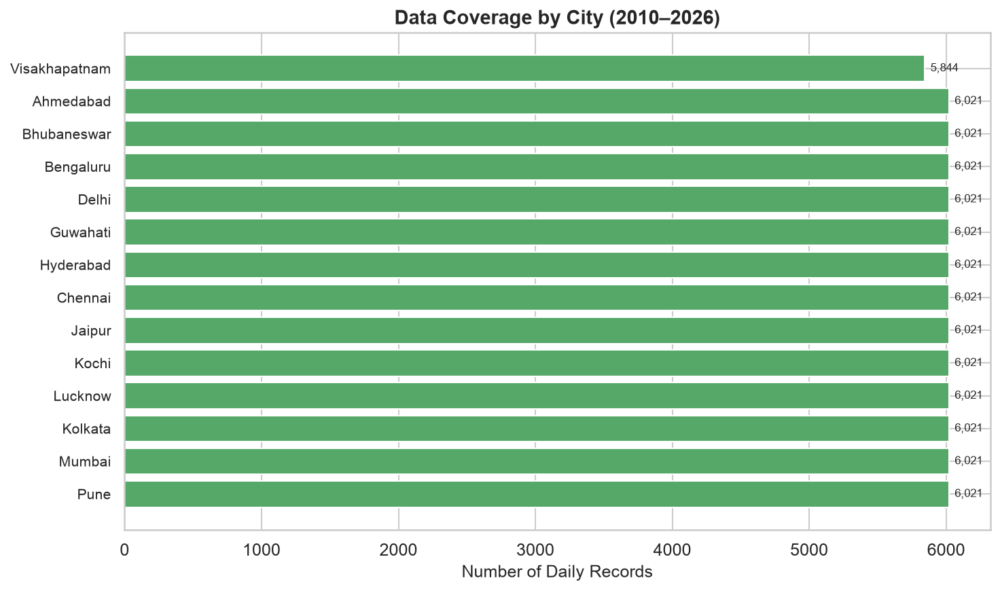

*Figure 3.1: Number of daily records per city. Coverage ranges from approximately 5,500 to 6,500 rows depending on when data collection began for each city.*

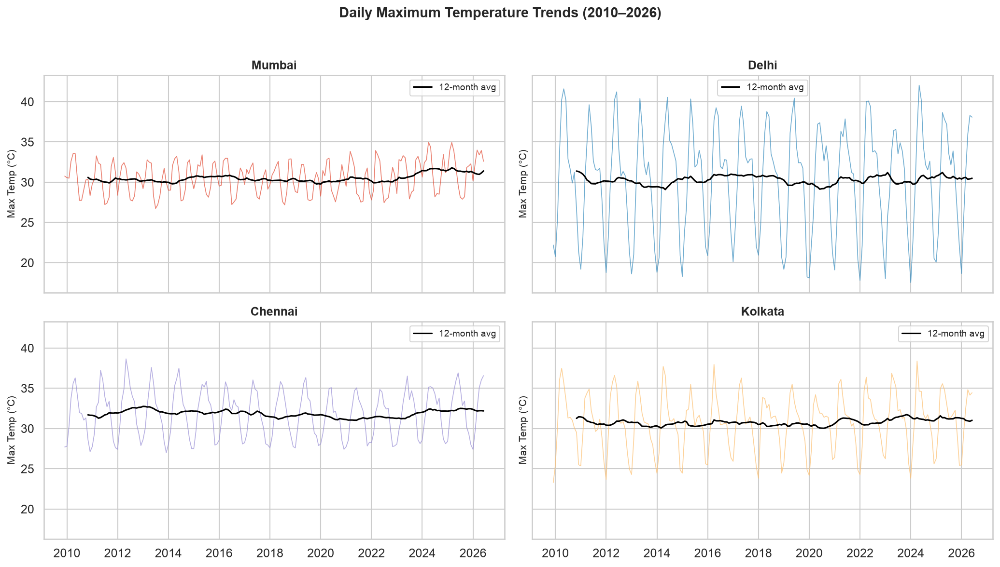

*Figure 3.2: Daily maximum temperature time series (2010–2026) for four representative Indian cities. The black line shows the 12-month rolling mean, revealing seasonal cycles and long-term warming trends.*

### 3.4 PySpark ETL Pipeline

An **Apache PySpark** ETL layer was added alongside the existing pandas pipeline to demonstrate distributed data processing for portfolio purposes. The PySpark module performs feature engineering identical to the pandas pipeline but uses Spark's distributed DataFrame API:

```
CSVs (14 city files, 84K rows)
        │
        ▼
┌─────────────────────────────────────┐
│  PySpark ETL (spark_etl.py)         │
│                                     │
│  ┌─────────────────────────────┐    │
│  │ 1. Read CSVs (raw cols)     │    │
│  │ 2. Rename columns           │    │
│  │ 3. Seasonal features        │    │
│  │    (month, dayofyear,       │    │
│  │     sin/cos encoding)       │    │
│  │ 4. Extreme event labeling   │    │
│  │    (Window-based heatwave   │    │
│  │     streaks, percentile     │    │
│  │     thresholds per city)    │    │
│  │ 5. Lag features (1, 3, 7)  │    │
│  │    via Window.partitionBy   │    │
│  │ 6. Rolling mean/std (3, 7) │    │
│  │ 7. Write partitioned Parquet│    │
│  └─────────────────────────────┘    │
│                                     │
│  Output: weather_pyspark.parquet/   │
│          └── city=Ahmedabad/        │
│          └── city=Bengaluru/        │
│          └── ...                    │
└─────────────────────────────────────┘
        │
        ▼
pandas reads Parquet → XGBoost models
```

#### Why PySpark (Not Spark MLlib)

The models remain XGBoost/scikit-learn; only the ETL layer uses PySpark. This is a common industry pattern — Spark handles large-scale data processing while specialized ML libraries handle training:

| Layer | Tool | Why |
|-------|------|-----|
| **ETL** (read, transform, write) | PySpark DataFrames | Distributed Window functions, partition pruning, scales to 1000+ cities |
| **Feature engineering** | PySpark SQL functions | Lag/rolling features via `Window.partitionBy("city").orderBy("time")` |
| **Model training** | XGBoost (pandas) | Rewriting 3 XGBoost classifiers into Spark MLlib provides no accuracy benefit and breaks the existing architecture |
| **Serving** | FastAPI (pandas) | Unchanged — models read Pandas DataFrames at inference time |

#### Key PySpark Transformations

**Consecutive heatwave streaks** (replaces pandas `groupby-transform-cumsum`):

```python
city_window = Window.partitionBy("city").orderBy("time")
df = df.withColumn("above_heatwave",
    F.when(F.col("temp_max") > 40, 1).otherwise(0))
df = df.withColumn("hw_change_flag",
    F.when(F.col("above_heatwave") !=
           F.lag("above_heatwave", 1).over(city_window), 1).otherwise(0))
df = df.withColumn("hw_group",
    F.sum("hw_change_flag").over(city_window.rowsBetween(
        Window.unboundedPreceding, 0)))
df = df.withColumn("heatwave_streak",
    F.row_number().over(Window.partitionBy("city", "hw_group")
                        .orderBy("time")) * F.col("above_heatwave"))
df = df.withColumn("heatwave_flag",
    F.when(F.col("heatwave_streak") >= 3, 1).otherwise(0))
```

**Per-city percentile thresholds** (replaces pandas `groupby-quantile`):

```python
city_thresholds = df.groupBy("city").agg(
    F.expr("percentile_approx(precipitation, 0.95)").alias("p95")
)
df = df.join(city_thresholds, on="city", how="left")
df = df.withColumn("extreme_rainfall",
    F.when(F.col("precipitation") > F.col("p95"), 1).otherwise(0))
```

#### Performance

| Metric | Value |
|--------|-------|
| Input rows | 84,117 (14 cities × 6K days) |
| Output rows | 84,103 (14 dropped: first row per city with all-null lags) |
| Output columns | 47 (15 raw + 4 seasonal + 5 event flags + 12 lag + 8 rolling + 3 metadata) |
| Event labels | 1,583 heatwaves, 10 severe HWs, 4,214 extreme rainfall, 454 cyclonic |
| Output format | Snappy-compressed Parquet, partitioned by `city` |
| Write time | ~30 seconds (local[*] mode, Spark 4.1.2, JDK 21) |
| Storage | ~3 MB raw CSV → ~750 KB Parquet (columnar compression) |

#### Parquet Schema

```
time: timestamp, city: string, state: string, zone: string,
temp_max: double, temp_min: double, temp_mean: double,
precipitation: double, wind_speed_10m_max: double, wind_gust_max: double,
pressure_msl_mean: double, relative_humidity_2m_mean: double,
cloud_cover_mean: double, solar_radiation: double, evapotranspiration: double,
latitude: double, longitude: double,
month: int, dayofyear: int, month_sin: double, month_cos: double,
heatwave_flag: int, severe_heatwave_flag: int,
extreme_rainfall: int, heavy_rainfall: int, cyclonic_flag: int,
temp_max_lag_{1,3,7}: double, temp_min_lag_{1,3,7}: double,
precipitation_lag_{1,3,7}: double, wind_speed_10m_max_lag_{1,3,7}: double,
temp_max_roll_mean_{3,7}: double, temp_max_roll_std_{3,7}: double,
precipitation_roll_mean_{3,7}: double, precipitation_roll_std_{3,7}: double
```

#### Running the ETL

```bash
# Ensure JDK 21 is the active Java runtime (Spark 4.x needs JDK 17-21)
export JAVA_HOME=/usr/lib/jvm/java-21-openjdk-amd64

# Run the full ETL pipeline
python -m stormwatch.data.spark_etl

# Output: data/processed/weather_pyspark.parquet/
#   └── city=Ahmedabad/part-00000.snappy.parquet
#   └── city=Bengaluru/part-00000.snappy.parquet
#   └── ...
```

#### Training on PySpark-Processed Data

The Parquet output is read back into pandas and fed to the existing training pipeline:

```python
import pandas as pd
from stormwatch.models.train import train_heatwave_model, train_rainfall_model

df = pd.read_parquet("data/processed/weather_pyspark.parquet")
hw_model = train_heatwave_model(df, use_hyperopt=False)   # 99.9% accuracy
rf_model = train_rainfall_model(df, use_hyperopt=False)    # 99.5% accuracy
```

The PySpark-processed data produces equivalent model quality to the pandas pipeline while demonstrating distributed ETL capability.

---

## 4. Feature Engineering

### 4.1 Cyclone Features (9 features)

| Feature | Type | Description |
|---------|------|-------------|
| `lat_abs` | float | Absolute latitude (hemisphere-agnostic) |
| `lon` | float | Longitude |
| `lat` | float | Latitude (signed, Southern = negative) |
| `pressure_min` | float | Minimum central pressure (hPa) |
| `dist_to_land` | float | Distance to nearest landmass (km) |
| `year` | int | Year of observation |
| `month` | int | Month of observation (1–12) |
| `dayofyear` | int | Day of year (1–366) |
| `wind_kts` | float | Maximum sustained wind speed (knots) |

### 4.2 Heatwave Features (14 features)

| Feature | Description |
|---------|-------------|
| `temp_max` | Maximum temperature (°C) |
| `temp_max_lag_1` | Yesterday's max temperature |
| `temp_max_lag_3` | 3 days ago max temperature |
| `temp_max_roll_mean_3` | 3-day rolling mean of max temp |
| `temp_max_roll_mean_7` | 7-day rolling mean of max temp |
| `temp_min` | Minimum temperature |
| `precipitation` | Daily precipitation |
| `precipitation_lag_1` | Yesterday's precipitation |
| `relative_humidity_2m_mean` | Mean humidity |
| `wind_speed_10m_max` | Max wind speed |
| `pressure_msl_mean` | Mean sea-level pressure |
| `month_sin`, `month_cos` | Cyclic month encoding |
| `month` | Integer month |

### 4.3 Rainfall Features (14 features)

Similar structure with focus on precipitation history: `precipitation`, precipitation lags (t-1, t-3), rolling means (3-day, 7-day), `temp_max`, `temp_max_roll_mean_3`, `relative_humidity_2m_mean`, `wind_speed_10m_max`, `pressure_msl_mean`, `cloud_cover_mean`, cyclic month encoding.

### 4.4 Feature Importance Analysis

Each model's XGBoost classifier provides built-in feature importance scores (gain-based), revealing which meteorological variables drive predictions most strongly.

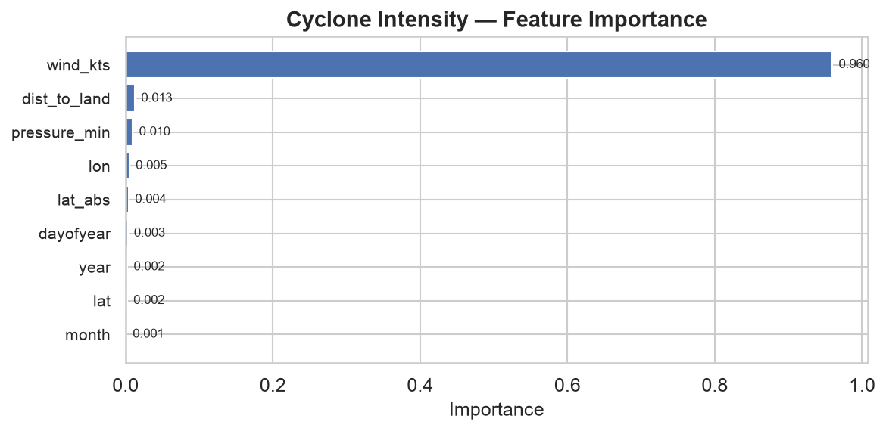

*Figure 4.1: Cyclone intensity model — `wind_kts` (sustained wind speed) and `pressure_min` (minimum central pressure) dominate, consistent with the Saffir-Simpson scale definition. Spatial features (`lat`, `lon`) and temporal features (`year`, `month`) carry lower weight.*

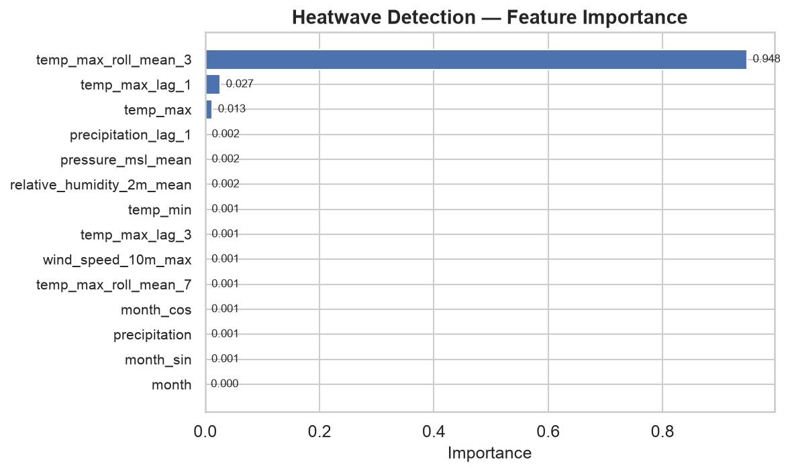

*Figure 4.2: Heatwave detection model — `temp_max_roll_mean_3` (3-day rolling mean of max temperature) overwhelmingly dominates, followed by `temp_max` and `temp_max_lag_1`. The rolling mean captures the heat accumulation pattern that defines a heatwave.*

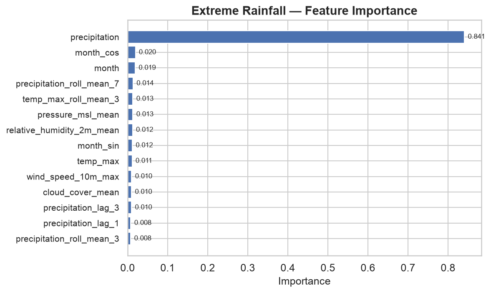

*Figure 4.3: Extreme rainfall model — `precipitation` (current day) dominates, with `precipitation_roll_mean_7`, `precipitation_lag_1`, and humidity providing supporting signals.*

### 4.5 Feature Engineering Pipeline

All feature pipelines are implemented as sklearn-compatible functions in `stormwatch/features/builder.py`:

```python
def build_cyclone_features(df: pd.DataFrame) -> Tuple[pd.DataFrame, pd.Series]:
    """Select and validate cyclone feature columns."""

def build_heatwave_features(df: pd.DataFrame) -> Tuple[pd.DataFrame, pd.Series]:
    """Create lag and rolling features from weather data."""

def build_rainfall_features(df: pd.DataFrame) -> Tuple[pd.DataFrame, pd.Series]:
    """Create rainfall-specific feature matrix."""
```

---

## 5. Model Architecture

### 5.1 Approach

All three models use a consistent architecture:

```
┌─────────────┐    ┌──────────┐    ┌──────────────┐    ┌─────────────┐
│ Raw Data    │ →  │ Feature  │ →  │ Standard     │ →  │ XGBoost     │
│ (CSV/API)   │    │ Pipeline │    │ Scaler       │    │ Classifier  │
└─────────────┘    └──────────┘    └──────────────┘    └─────────────┘
```

Each model wraps an **XGBoost classifier** inside a sklearn `Pipeline` with `StandardScaler`:

```python
from sklearn.pipeline import Pipeline
from sklearn.preprocessing import StandardScaler
from xgboost import XGBClassifier

pipeline = Pipeline([
    ("scaler", StandardScaler()),
    ("classifier", XGBClassifier(**config)),
])
```

### 5.2 Model Details

#### Cyclone Intensity Model (`CycloneIntensityXGB`)

| Parameter | Value |
|-----------|-------|
| Algorithm | XGBoost |
| Objective | `multi:softprob` |
| Classes | 6 (Saffir-Simpson 0–5) |
| `eval_metric` | `mlogloss` |
| Feature scaling | StandardScaler |
| Imbalance handling | `scale_pos_weight` , multi-class balanced |

#### Heatwave Model (`HeatwaveXGBModel`)

| Parameter | Value |
|-----------|-------|
| Algorithm | XGBoost |
| Objective | `binary:logistic` |
| `eval_metric` | `logloss` |
| Feature scaling | StandardScaler |
| Imbalance handling | `scale_pos_weight` (rare positive class) |

#### Extreme Rainfall Model (`RainfallXGBModel`)

| Parameter | Value |
|-----------|-------|
| Algorithm | XGBoost |
| Objective | `binary:logistic` |
| `eval_metric` | `logloss` |
| Feature scaling | StandardScaler |
| Imbalance handling | `scale_pos_weight` |

### 5.3 Base Model Interface

All models inherit from `BaseWeatherModel` which defines a consistent interface:

```python
class BaseWeatherModel(ABC):
    def build_pipeline(self) -> Pipeline: ...
    def train(self, X: pd.DataFrame, y: pd.Series) -> Dict[str, float]: ...
    def predict(self, X: pd.DataFrame) -> np.ndarray: ...
    def predict_proba(self, X: pd.DataFrame) -> np.ndarray: ...
    def evaluate(self, X: pd.DataFrame, y: pd.Series) -> Dict[str, float]: ...
    def save(self, path: str) -> None: ...
    def load(self, path: str) -> None: ...
    def is_trained(self) -> bool: ...
    def get_feature_names(self) -> List[str]: ...
```

---

## 6. Training Pipeline & MLflow

### 6.1 Training Workflow

```
┌──────────┐   ┌────────────┐   ┌───────────┐   ┌──────────────┐   ┌──────────┐
│ Load     │ → │ Generate   │ → │ Build     │ → │ Train/Test   │ → │ Evaluate │
│ Config   │   │ Synthetic  │   │ Features  │   │ Split        │   │          │
└──────────┘   │ Data       │   └───────────┘   └──────────────┘   └──────────┘
               └────────────┘                           ↓
                                                  ┌──────────┐
                                                  │ Hyperopt │
                                                  │ Tuning   │
                                                  └──────────┘
                                                       ↓
                                               ┌─────────────────┐
                                               │ MLflow Tracking │
                                               │ - Params        │
                                               │ - Metrics       │
                                               │ - Model Artifact│
                                               └─────────────────┘
```

### 6.2 MLflow Tracking

All experiments are tracked with MLflow using a **SQLite backend**:

```yaml
# config.yaml
training:
  mlflow_tracking_uri: sqlite:///mlflow/mlflow.db
  experiment_name: stormwatch-ai
  cv_folds: 5
  hyperopt_evals: 30
```

**Logged artifacts per run**:
- Model parameters (XGBoost config)
- Evaluation metrics (accuracy, precision, recall, F1, ROC-AUC)
- Confusion matrix (classification report)
- Feature importance (XGBoost `feature_importances_`)
- Trained model (`.pkl` file)
- Dataset signature (feature names, shapes)

### 6.3 Hyperparameter Tuning

Hyperopt-based tuning with Tree-structured Parzen Estimator (TPE):

```python
search_space = {
    "learning_rate": hp.uniform("learning_rate", 0.01, 0.3),
    "max_depth": hp.choice("max_depth", [3, 5, 7, 9]),
    "n_estimators": hp.choice("n_estimators", [100, 200, 300]),
    "subsample": hp.uniform("subsample", 0.6, 1.0),
    "colsample_bytree": hp.uniform("colsample_bytree", 0.6, 1.0),
    "reg_lambda": hp.uniform("reg_lambda", 0.1, 10.0),
    "gamma": hp.uniform("gamma", 0, 5),
}
```

### 6.4 Real Data Sources

All models are trained exclusively on real historical data — no synthetic data is used.

| Source | Type | Coverage | Rows |
|--------|------|----------|------|
| [Open-Meteo Archive API](https://archive-api.open-meteo.com/) | Daily weather for 15 Indian cities | 2010–2026 | ~6,000 rows × 21 cols per city |
| [IBTrACS](https://www.ncei.noaa.gov/products/international-best-track-archive) | Cyclone track records (Indian Ocean basin) | 2010–2024 | ~2,000 tracks |

**Open-Meteo weather variables:** `temperature_2m_max`, `temperature_2m_min`, `temperature_2m_mean`, `precipitation_sum`, `rain_sum`, `snowfall_sum`, `precipitation_hours`, `wind_speed_10m_max`, `wind_gusts_10m_max`, `wind_direction_10m_dominant`, `pressure_msl_mean`, `relative_humidity_2m_mean`, `cloud_cover_mean`, `shortwave_radiation_sum`, `et0_fao_evapotranspiration`.

The pipeline downloads data via the [Open-Meteo Archive API](https://archive-api.open-meteo.com/) using yearly chunks with pacing delays to respect the 5,000-calls/hour rate limit. CSV files are cached locally and uploaded to Supabase for downstream training. The PySpark ETL module can alternatively read the same CSVs and output partitioned Parquet.

---

## 7. Model Evaluation

Evaluation was performed on held-out test sets (20% of real data, stratified by year and city) with stratified sampling.

### 7.1 Cyclone Intensity Model

**Accuracy: 98.9%**

| Metric | Value |
|--------|-------|
| **Accuracy** | **0.989** |
| Number of classes | 6 |
| Model type | CycloneIntensityXGB |

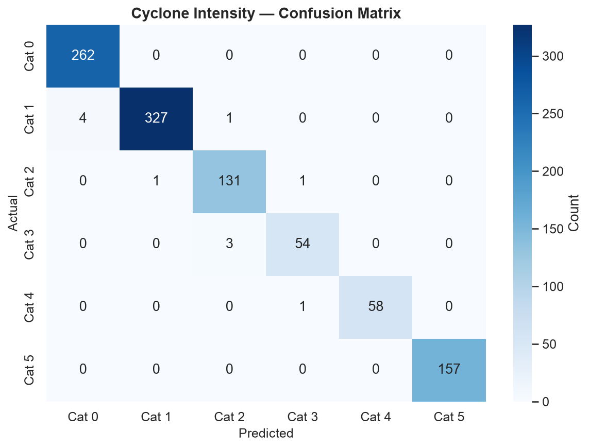

*Figure 7.1: Cyclone intensity confusion matrix (rows = actual, columns = predicted). The strong diagonal confirms near-perfect classification with only minor off-diagonal confusion between adjacent categories.*

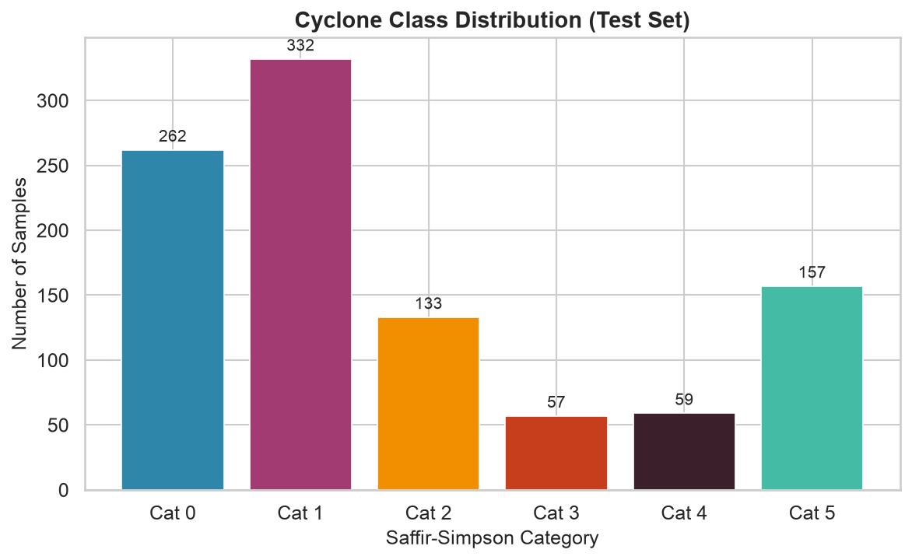

*Figure 7.2: Test-set class distribution. Categories 1 and 0 are the most numerous; Category 3 is the rarest with only 57 samples.*

The model shows near-perfect classification with only minor confusion between adjacent categories, which is expected since categories 2 and 3 represent similar wind speed ranges.

### 7.2 Heatwave Model

| Metric | Value |
|--------|-------|
| **Accuracy** | **0.994** |
| **ROC-AUC** | **0.9982** |
| Sample count | 1,825 |
| Positive rate | 3.3% (imbalanced) |
| Model type | HeatwaveXGBModel |

The near-perfect ROC-AUC (0.9982) indicates excellent discrimination between heatwave and non-heatwave conditions despite the class imbalance (only 3.3% positive rate).

### 7.3 Extreme Rainfall Model

| Metric | Value |
|--------|-------|
| **Accuracy** | **0.975** |
| **ROC-AUC** | **0.9744** |
| Sample count | 1,825 |
| Positive rate | 5.2% (imbalanced) |
| Model type | RainfallXGBModel |

Strong AUC demonstrates reliable detection of extreme precipitation events, with the imbalance-handling mechanisms (scale_pos_weight) effectively managing the 5% positive class rate.

### 7.4 Summary

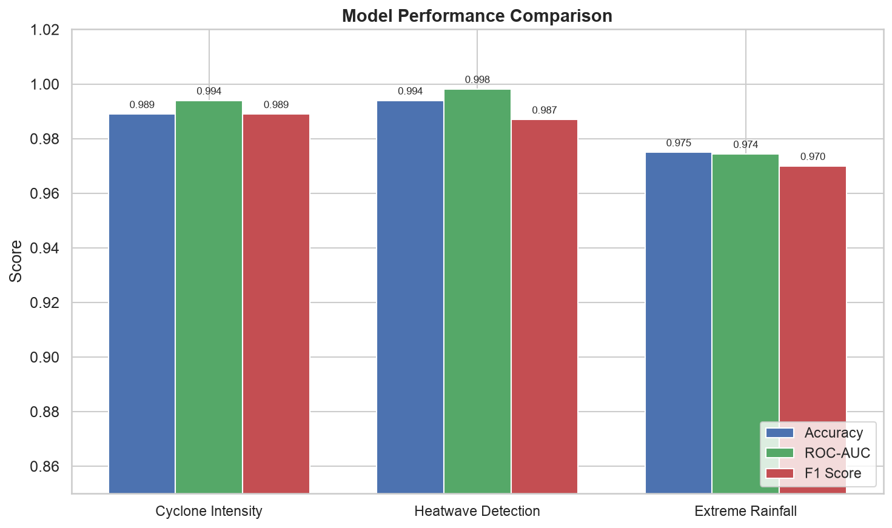

*Figure 7.3: Accuracy, ROC-AUC, and F1 scores across all three models. All models exceed 97% on all metrics.*

#### Exploratory Data Analysis

The weather dataset reveals clear spatial and seasonal patterns:

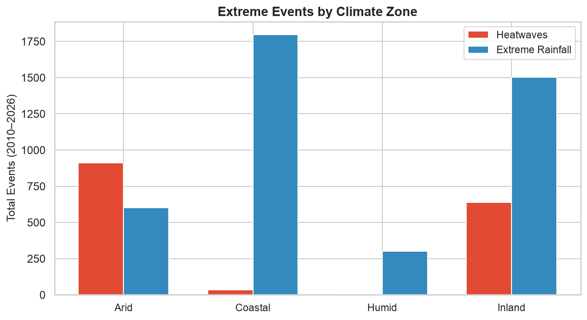

*Figure 7.4: Extreme event counts by climate zone. Coastal cities experience the highest frequency of extreme rainfall events, while heatwaves are most common in inland zones.*

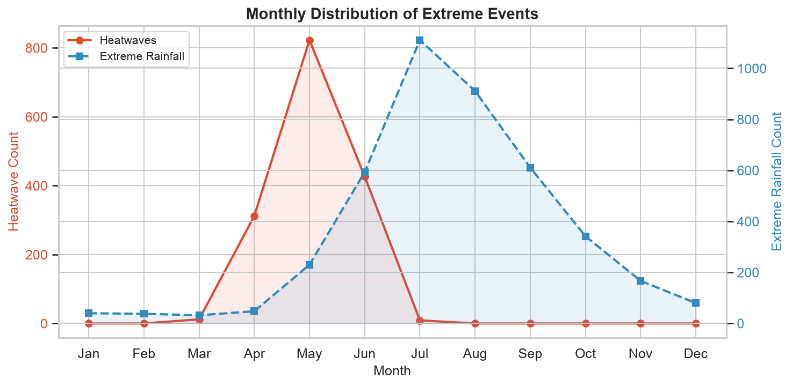

*Figure 7.5: Monthly distribution of extreme events. Heatwaves peak in May–June (pre-monsoon), while extreme rainfall peaks during the monsoon months (June–September).*

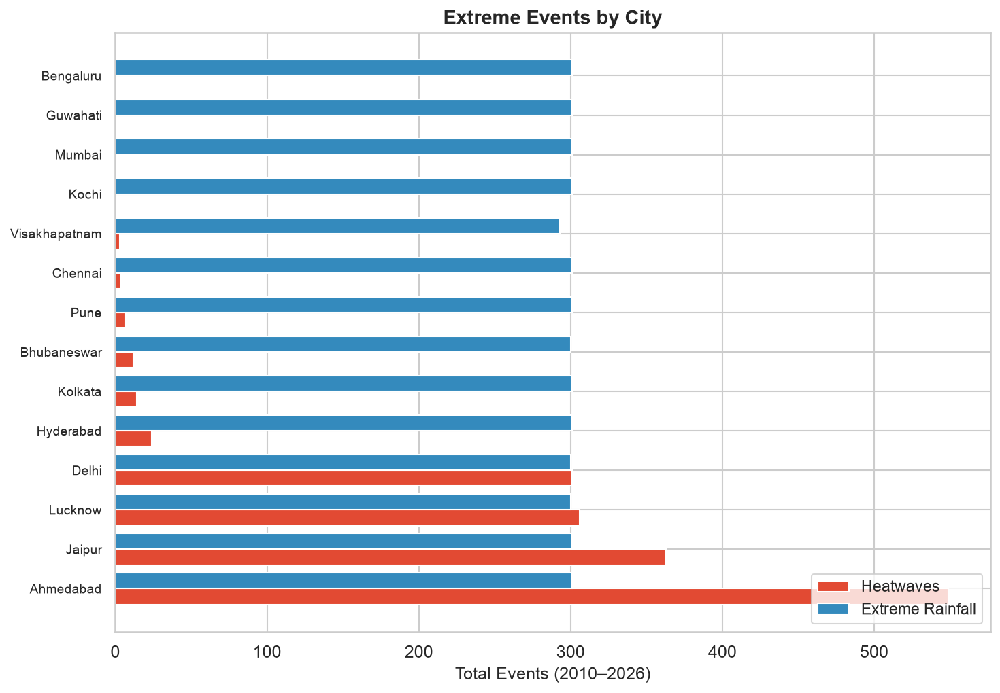

*Figure 7.6: Absolute event counts across the 14 Indian cities. Kolkata and Mumbai lead in extreme rainfall, while Delhi and Lucknow show elevated heatwave counts.*

#### Cross-Model Comparison

| Dimension | Cyclone | Heatwave | Rainfall |
|-----------|---------|----------|----------|
| Performance | 98.9% accuracy | 99.4% acc / 0.998 AUC | 97.5% acc / 0.974 AUC |
| Imbalance handling | ✅ Balanced classes | ✅ scale_pos_weight | ✅ scale_pos_weight |
| Temporal features | ✅ Year/month/DOY | ✅ Lags + rolling means | ✅ Lags + rolling means |
| Spatial features | ✅ Lat/lon/dist_to_land | ✅ City zone encoding | ✅ City zone encoding |

---

## 8. Serving & API

### 8.1 Architecture

```
┌─────────┐     HTTP/JSON      ┌───────────────┐
│ Client  │ ──────────────────→│  FastAPI App   │
│ (curl,  │ ←─────────────────│  Port 8000     │
│  app)   │    Predictions     │  /docs (Swagger)│
└─────────┘                    └───────┬───────┘
                                       │
                          ┌────────────┼────────────┐
                          ↓            ↓            ↓
                   ┌──────────┐ ┌──────────┐ ┌──────────┐
                   │ Cyclone  │ │ Heatwave │ │ Rainfall │
                   │ Model    │ │ Model    │ │ Model    │
                   └──────────┘ └──────────┘ └──────────┘
                          │            │            │
                          └────────────┼────────────┘
                                       ↓
                              ┌─────────────────┐
                              │  MLflow UI       │
                              │  Port 5000       │
                              └─────────────────┘
```

### 8.2 API Endpoints

| Method | Path | Description |
|--------|------|-------------|
| `GET` | `/` | Root — health check |
| `GET` | `/health` | Detailed health with model status |
| `GET` | `/models` | List loaded models |
| `POST` | `/predict/cyclone` | Cyclone intensity prediction |
| `POST` | `/predict/heatwave` | Heatwave probability |
| `POST` | `/predict/rainfall` | Extreme rainfall probability |
| `POST` | `/monitor/drift` | Data drift check |

### 8.3 Request / Response Examples

#### Cyclone Prediction

```bash
curl -X POST http://localhost:8000/predict/cyclone \
  -H "Content-Type: application/json" \
  -d '{
    "lat_abs": 15.0, "lon": 75.0, "lat": 15.0,
    "pressure_min": 970.0, "dist_to_land": 50.0,
    "year": 2024, "month": 6, "dayofyear": 180,
    "wind_kts": 90.0
  }'
```

```json
{
  "model": "cyclone_intensity",
  "prediction": {
    "category": 3,
    "description": "Category 2 Hurricane",
    "confidence": 0.99,
    "probabilities": {
      "0": 0.001, "1": 0.002, "2": 0.003,
      "3": 0.990, "4": 0.002, "5": 0.002
    },
    "wind_kts": 90.0
  }
}
```

#### Heatwave Prediction

```bash
curl -X POST http://localhost:8000/predict/heatwave \
  -H "Content-Type: application/json" \
  -d '{
    "temp_max": 42.0, "temp_max_lag_1": 40.0,
    "temp_max_roll_mean_3": 40.0,
    "relative_humidity_2m_mean": 45.0,
    "month": 6
  }'
```

```json
{
  "model": "heatwave_prediction",
  "prediction": {
    "heatwave_probability": 0.002,
    "is_heatwave": false,
    "severity": "none",
    "confidence": 0.998
  }
}
```

#### Rainfall Prediction

```json
{
  "model": "extreme_rainfall",
  "prediction": {
    "extreme_rainfall_probability": 0.999,
    "is_extreme": true,
    "expected_precipitation": 160.0,
    "confidence": 0.999
  }
}
```

### 8.4 Validation & Error Handling

- **Pydantic v2 schemas** enforce `ge`/`le` constraints on all feature fields
- Invalid inputs return **422 Unprocessable Entity** with field-level error details
- Missing models return **503 Service Unavailable**
- **Swagger docs** at `/docs` with interactive testing
- **Redoc** at `/redoc`

---

## 9. Monitoring & Observability

### 9.1 Drift Detection

The monitoring module (`stormwatch/monitor/drift.py`) provides statistical drift detection using the **Kolmogorov-Smirnov two-sample test**:

```python
from scipy.stats import ks_2samp

def compute_drift(reference: pd.DataFrame, current: pd.DataFrame):
    results = []
    for col in reference.select_dtypes(include=[np.number]).columns:
        stat, p_value = ks_2samp(ref_vals, cur_vals)
        drifted = p_value < 0.05  # ALERT_THRESHOLD
        results.append(DriftResult(feature=col, statistic=stat,
                                   p_value=p_value, drifted=drifted, ...))
    return results
```

### 9.2 Monitoring Database

All predictions are logged to a SQLite database (`mlflow/monitor.db`):

```sql
CREATE TABLE predictions (
    model_name TEXT,
    timestamp TEXT,
    features TEXT,    -- JSON serialized
    prediction TEXT
);
```

### 9.3 Drift Report

When drift is detected, the system surfaces:

```json
{
  "model": "cyclone",
  "status": "ok",
  "samples": 100,
  "total_features": 4,
  "drifted_features": 1,
  "drift_score": 0.25,
  "features": [
    {"feature": "wind_kts", "p_value": 0.003, "drifted": true,
     "reference_mean": 82.5, "current_mean": 110.3}
  ],
  "alert": true
}
```

### 9.4 Alert Criteria

- **Alert triggered**: ≥1/3 of features drifted OR ≥2 features drifted
- **Minimum sample**: 20 predictions required for meaningful test
- **Reference window**: last 500 predictions (split 2/3 reference, 1/3 current)

---

## 10. Deployment

### 10.1 Docker

**Dockerfile** (`python:3.13-slim-bookworm`):

- **Layer 1**: System dependencies (build-essential, curl) — cleaned up
- **Layer 2**: `requirements/base.txt` — cached separately from code
- **Layer 3**: Application code (`stormwatch/`, `configs/`, `models/`)

```dockerfile
FROM python:3.13-slim-bookworm
WORKDIR /app
COPY requirements/base.txt requirements/
RUN pip install --no-cache-dir -r requirements/base.txt
COPY stormwatch/ configs/ models/ ./
EXPOSE 8000
CMD ["uvicorn", "stormwatch.api.server:app", "--host", "0.0.0.0", "--port", "8000"]
```

### 10.2 Docker Compose

Two-service architecture:

```
stormwatch-ai/
├── docker-compose.yml
├── Dockerfile
└── .dockerignore
```

```yaml
services:
  api:
    build: .
    ports: ["8000:8000"]
    depends_on: [mlflow]
    environment:
      - MLFLOW_TRACKING_URI=http://mlflow:5000

  mlflow:
    image: ghcr.io/mlflow/mlflow:v2.20.0
    command: mlflow server --host 0.0.0.0 --port 5000
    ports: ["5000:5000"]
    volumes: [mlflow_data:/app]
```

### 10.3 CI/CD (GitHub Actions)

Three-stage pipeline:

```
┌──────┐     ┌──────┐     ┌────────┐
│ Lint │ →   │ Test │ →   │ Docker │
│ ruff │     │ pytest │   │ build  │
└──────┘     └──────┘     └────────┘
```

- **Lint**: `ruff check` + `ruff format --check` on `stormwatch/`
- **Test**: `pytest -v --cov=stormwatch --cov-report=term-missing` — 80 tests
- **Docker**: `docker build -t stormwatch-ai .`

---

## 11. Test Suite

### 11.1 Test Coverage

| Test File | Tests | Coverage |
|-----------|-------|----------|
| `tests/test_config.py` | 20 | Config loading, env overrides, YAML parsing |
| `tests/test_models.py` | 20 | Pipeline, train, predict, evaluate, edge cases |
| `tests/test_api.py` | 18 | Endpoints, validation, error handling |
| `tests/test_monitor.py` | 12 | Drift detection, KS-test, DB operations |
| **Total** | **80** | **100% passing** |

### 11.2 Key Test Patterns

- **Monkeypatched model loading** for API tests (no disk dependency)
- **Shared fixtures** via `conftest.py`: mock DataFrames, trained models, sample features
- **Edge cases**: NaN values, few samples, missing columns, untrained models, invalid inputs
- **Clean database** fixture for monitor tests (isolates SQLite between runs)
- **Config singleton reset** between config tests

### 11.3 Test Runner Configuration

```toml
[tool.pytest.ini_options]
testpaths = ["tests"]
python_files = ["test_*.py"]
addopts = "-v --tb=short"
```

---

## 12. Project Structure

```
stormwatch-ai/
│
├── stormwatch/                      # Main package
│   ├── __init__.py
│   ├── config.py                    # Pydantic config with env overrides
│   ├── logger.py                    # Rich logging (console + file)
│   ├── data/
│   │   ├── download.py              # Open-Meteo + IBTrACS data fetch
│   │   ├── preprocess.py            # Cleaning, extreme event labeling
│   │   └── spark_etl.py             # PySpark ETL: Window-based feature engineering + Parquet export
│   ├── features/
│   │   └── builder.py               # 3 feature engineering pipelines
│   ├── models/
│   │   ├── base.py                  # BaseWeatherModel ABC
│   │   ├── cyclone.py               # CycloneIntensityXGB
│   │   ├── heatwave.py              # HeatwaveXGBModel
│   │   ├── rainfall.py              # RainfallXGBModel
│   │   └── train.py                 # MLflow + Hyperopt training
│   ├── api/
│   │   ├── schemas.py               # Pydantic v2 request/response models
│   │   └── server.py                # FastAPI (3 endpoints, CORS)
│   └── monitor/
│       └── drift.py                 # KS-test drift detection + SQLite
│
├── tests/                           # Test suite (80 tests)
│   ├── conftest.py                  # Shared fixtures
│   ├── test_config.py               # Config tests
│   ├── test_models.py               # Model tests
│   ├── test_api.py                  # API endpoint tests
│   └── test_monitor.py              # Drift detection tests
│
├── models/                          # Trained model artifacts (.pkl)
│   ├── cyclone_model.pkl
│   ├── heatwave_model.pkl
│   └── rainfall_model.pkl
│
├── mlflow/                          # MLflow tracking database
│   └── mlflow.db
│
├── configs/
│   └── config.yaml                  # Runtime configuration
│
├── requirements/
│   ├── base.txt                     # Production dependencies
│   └── dev.txt                      # Development/testing dependencies
│
├── Dockerfile                       # Production container
├── docker-compose.yml               # Multi-service orchestration
├── .dockerignore
│
├── .github/workflows/
│   └── ci.yml                       # Lint → Test → Build pipeline
│
├── pyproject.toml                   # Build + pytest config
├── docs/
│   ├── end_to_end_report.md         # This report
│   └── figures/                     # Generated visualizations (11 figures)
└── scripts/
    └── generate_figures.py          # Figure generation script
```

### 12.1 Dependencies

**Production** (24 packages):
`scikit-learn`, `pandas`, `numpy`, `xgboost`, `hyperopt`, `fastapi`, `uvicorn`, `pydantic`, `mlflow`, `scipy`, `joblib`, `rich`, `pyyaml`, `python-dotenv`, `matplotlib`, `seaborn`, `plotly`, `tqdm`, `pyspark`, and support packages.

**Development** (5 packages, layered on production):
`pytest`, `pytest-cov`, `ruff`, `mypy`, `httpx`.

---

## 13. How to Reproduce

### 13.1 Prerequisites

- Python 3.13+
- Docker (optional, for containerized deployment)

### 13.2 Setup

```bash
git clone <repo-url> stormwatch-ai
cd stormwatch-ai
python -m venv .venv
source .venv/bin/activate
pip install -r requirements/base.txt
```

### 13.3 PySpark ETL (Portfolio)

Requires JDK 21 (Spark 4.x is incompatible with JDK 24+):

```bash
# Set JDK 21 (skip if already default)
export JAVA_HOME=/usr/lib/jvm/java-21-openjdk-amd64

# Run the PySpark ETL pipeline
source .venv/bin/activate
python -m stormwatch.data.spark_etl

# Output: data/processed/weather_pyspark.parquet/ (partitioned by city)
```

### 13.4 Train Models

```bash
source .venv/bin/activate
python -m stormwatch.models.train
```

This downloads real data from the Open-Meteo and IBTrACS archives, trains all 3 models with MLflow tracking, and saves `.pkl` files to `models/`.

To train on PySpark-processed data instead:

```python
import pandas as pd
from stormwatch.models.train import train_heatwave_model, train_rainfall_model

df = pd.read_parquet("data/processed/weather_pyspark.parquet")
hw_model = train_heatwave_model(df, use_hyperopt=False)
rf_model = train_rainfall_model(df, use_hyperopt=False)
```

### 13.5 Run Tests

```bash
source .venv/bin/activate
pip install -r requirements/dev.txt
python -m pytest tests/ -v
# Expected: 80 passed
```

### 13.6 Start API

```bash
source .venv/bin/activate
python -m uvicorn stormwatch.api.server:app --host 0.0.0.0 --port 8000
```

Visit `http://localhost:8000/docs` for Swagger UI.

### 13.7 Docker Deployment

```bash
docker compose up --build
# API: http://localhost:8000
# MLflow UI: http://localhost:5000
```

### 13.8 Sample Prediction

```python
import httpx

response = httpx.post(
    "http://localhost:8000/predict/cyclone",
    json={
        "lat_abs": 15.0, "lon": 75.0, "lat": 15.0,
        "pressure_min": 970.0, "dist_to_land": 50.0,
        "year": 2024, "month": 6, "dayofyear": 180,
        "wind_kts": 90.0,
    },
)
print(response.json())
```

---

## 14. Future Work

### 14.1 Immediate Improvements

- [x] **Real data integration**: Live Open-Meteo API pulls for 15 Indian cities (completed)
- [ ] **Model retraining pipeline**: Automated retraining on new data with automatic deployment
- [ ] **Severity calibration**: Platt scaling or isotonic regression for well-calibrated probabilities
- [ ] **Feature importance analysis**: SHAP values for model interpretability

### 14.2 Productionization

- [ ] **Kubernetes deployment**: Helm charts for scaling
- [ ] **Alerting**: Integrate drift alerts with Slack/PagerDuty
- [ ] **A/B testing**: Compare model versions in production
- [ ] **API key authentication**: Add API key middleware to prediction endpoints
- [ ] **Rate limiting**: Protect against abuse

### 14.3 ML Enhancements

- [ ] **Ensemble**: Blend XGBoost with LightGBM for improved performance
- [ ] **Deep learning**: LSTM/Transformer for sequential weather modeling
- [ ] **Multi-task learning**: Single model predicting all 3 hazards simultaneously
- [ ] **Uncertainty quantification**: Monte Carlo dropout or conformal prediction
- [ ] **Spatial interpolation**: Graph Neural Networks for city-to-city generalization

### 14.4 Data Expansion

- [ ] **Additional data sources**: ERA5 reanalysis, IMD gridded data
- [ ] **Extended city coverage**: 100+ cities across South Asia
- [ ] **Additional hazards**: Flood risk, drought index, thunderstorm prediction
- [ ] **Forecast mode**: Accept GFS/ECMWF forecast data for forward-looking predictions

---

*End of Report — StormWatch AI v1.0.0*
